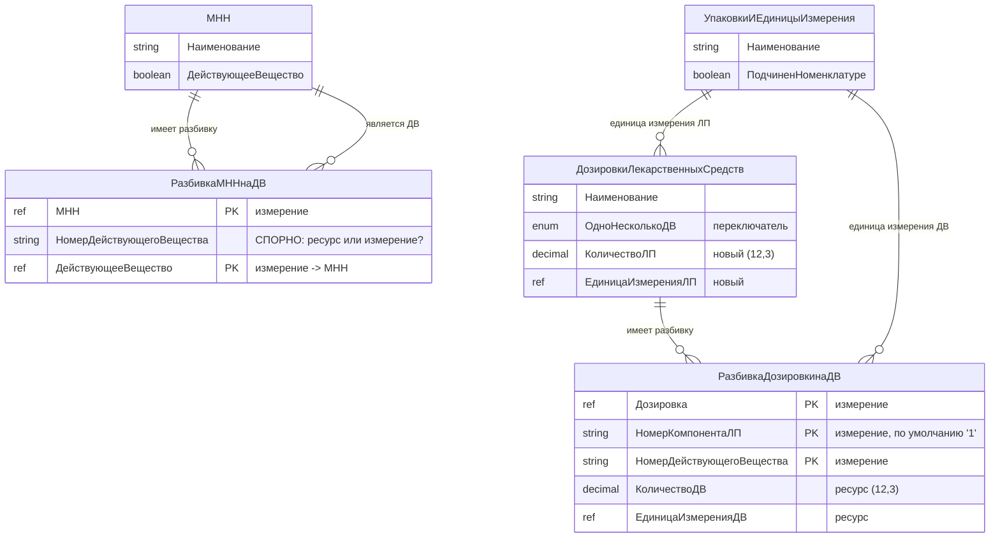
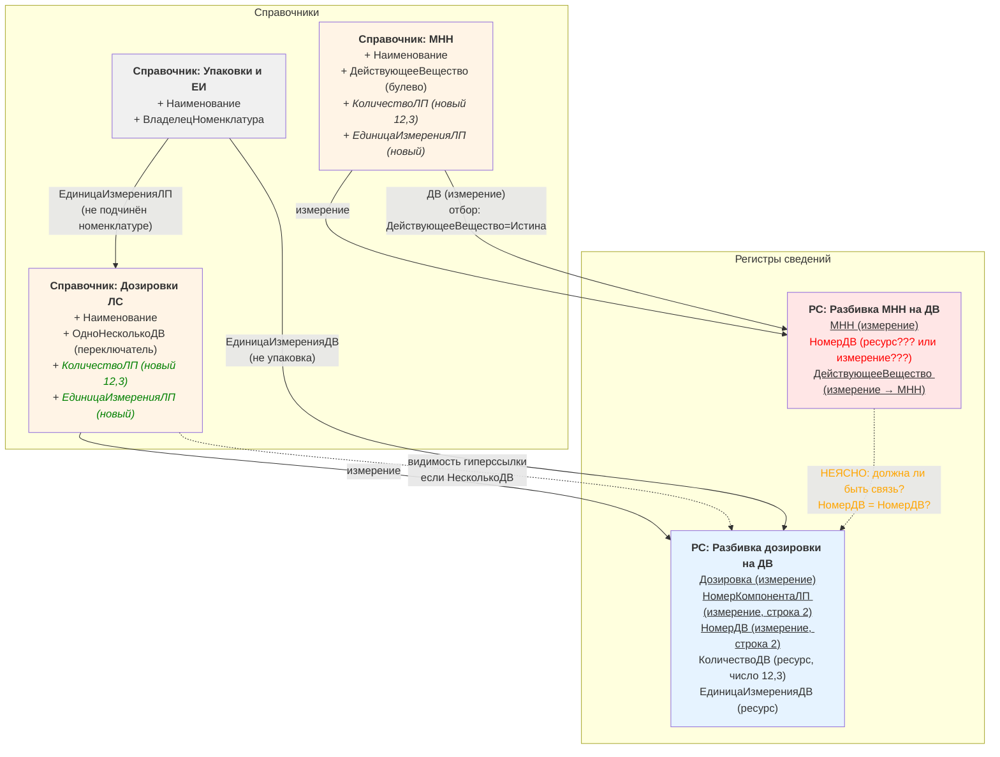
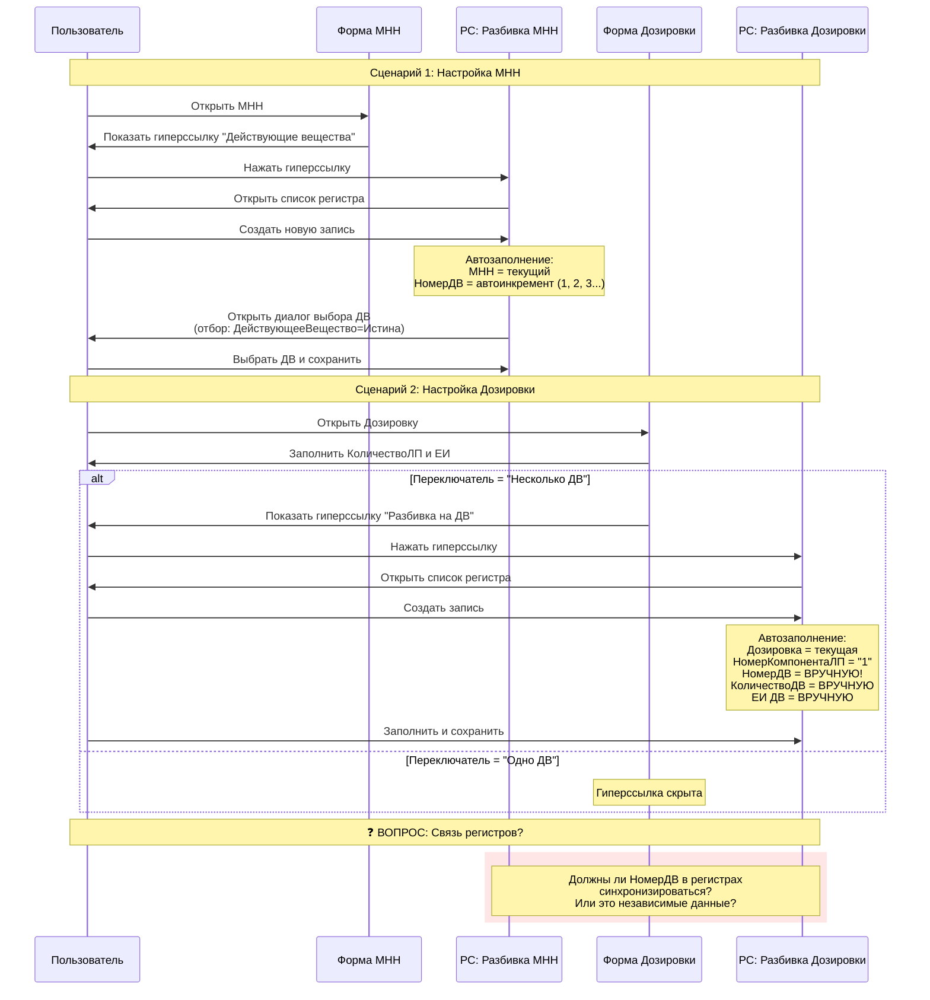
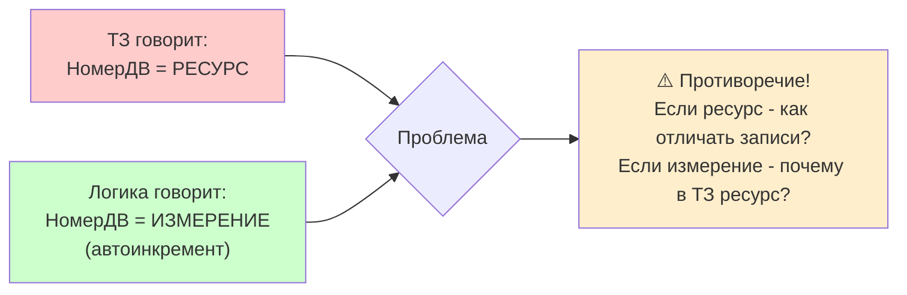
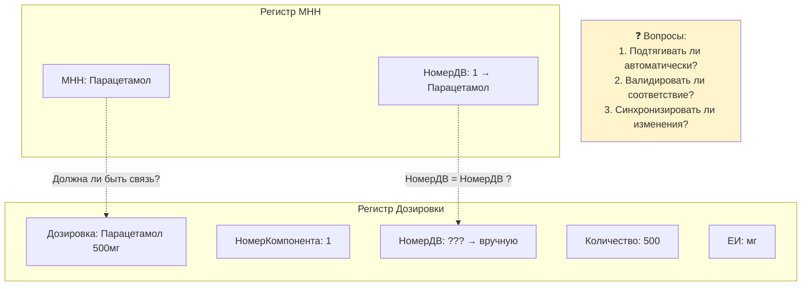

# Схема связей объектов метаданных (Задача 67411)

## Общая схема взаимосвязей

## Детальная схема с неясными связями

## Схема потоков данных

## Проблемные зоны (требуют уточнения)

### 🔴 Критичная проблема: тип поля "НомерДВ" в регистре МНН

### 🟡 Неясная связь между регистрами

## Легенда

- **Жирные линии** — обязательные связи по измерениям/реквизитам
- **Пунктирные линии** — неявные/неопределённые связи
- **Зелёный текст** — новые реквизиты
- **Красный текст** — проблемные/спорные места
- **Оранжевый текст** — требует уточнения

---

**Рекомендация:** Перед разработкой необходимо решить вопрос о типе поля "НомерДВ" в регистре МНН и определить логику связи между двумя регистрами разбивки.
